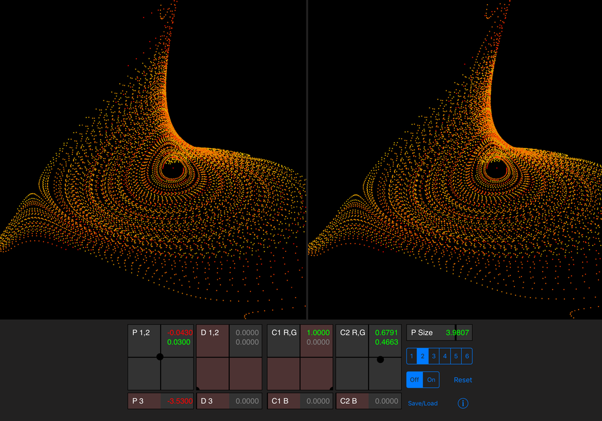

# Dynamical_Stereo
Cross-eyed stereo rendition of Dynamical System, for others like me who can't get enough of 3D.

For newer iPads.

Point clouds look beautiful in 3D, even cross-eyed 3D.

This little app demonstrates Swift interacting with Metal compute and render shaders,
using Metal to build the list of vertices to draw.

